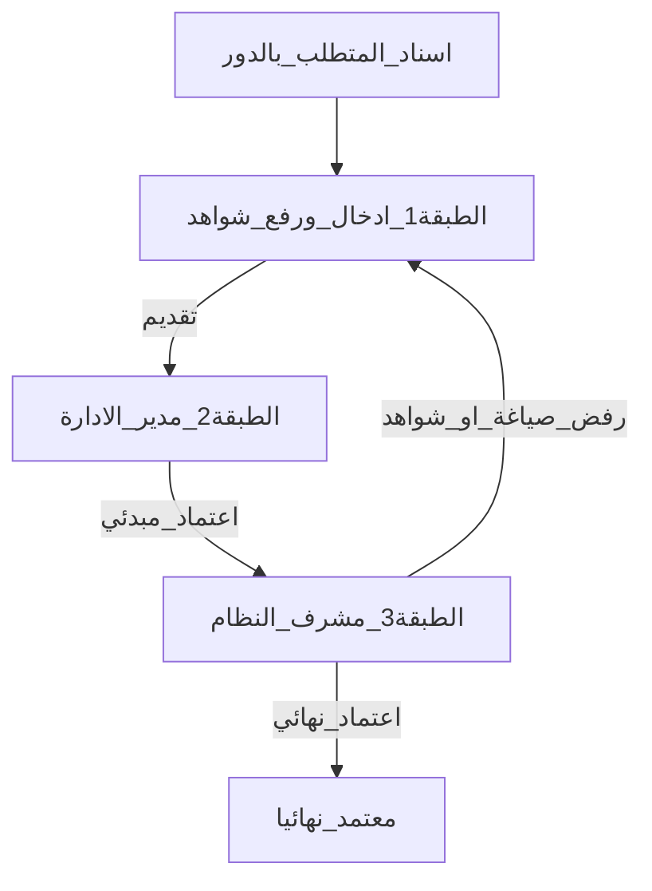

# تقرير هيكلة توحيد القياس والطبقات الثلاث

منصة **مِقياس** — جمعية الزاد.  
مصدر قياس موحّد مع ثلاث طبقات: إدخال → اعتماد مبدئي → اعتماد نهائي.

---

## 1) خريطة المجلدات

```
miqyas-phase1/
├── prisma/schema.prisma
├── scripts/
│   ├── import-excel-2026.ts
│   ├── migrate-unified-measurement.ts
│   └── migrate-measurement-layers.ts
├── src/app/(app)/
│   ├── my/                 # شواهد المؤشرات (الطبقة 1)
│   ├── dept-follow/        # مراجعة الإدارة (الطبقة 2)
│   ├── approvals/          # الاعتماد النهائي (الطبقة 3)
│   └── admin/assign/       # إسناد جماعي للمتطلبات
├── src/app/api/
│   ├── my/measurements/
│   ├── dept-follow/
│   ├── approvals/
│   └── admin/assign/
└── docs/architecture-measurement-unification.md
```

---

## 2) الطبقات الثلاث



| الطبقة | من | ماذا يفعل |
|--------|-----|-----------|
| 1 | موظف / رئيس قسم / مدير إدارة (حسب دور التعبئة والمالك) | فعلي + ماذا/كيف حصل + شواهد → مسودة أو تقديم |
| 2 | مدير الإدارة | تعديل السرد/الفعلي + اعتماد مبدئي أو إرجاع |
| 3 | مشرف النظام فقط | تعديل + قبول نهائي / رفض صياغة / رفض شواهد |

### حالات الفترة
مسودة → مقدَّم → معتمد مبدئياً → معتمد نهائياً  
مرفوض صياغة · مرفوض شواهد (مع أحداث تراكمية في `ApprovalEvent`)

### تفريق من يملأ
- حقل `fillerRole` على المتطلب: موظف / رئيس قسم / مدير إدارة
- `ownerId` مستخدم مسؤول
- شاشة `/admin/assign` للإسناد الجماعي

---

## 3) نموذج البيانات

```
MeasurementRequirement (code, fillerRole, ownerId, departmentId…)
  ├── MeasurementPeriod (فعلي، سرد، حالة الاعتماد، اعتماد مبدئي/نهائي، صياغة مقترحة)
  │     ├── Evidence (status ACTIVE/REJECTED + سبب)
  │     └── ApprovalEvent (تراكم الإجراءات)
  └── Kpi[] ← إسقاط مزامَن عبر measurement-sync
```

التحليلات واللوحات تعتمد الحالة **معتمد نهائياً** فقط.

---

## 4) مصفوفة الصلاحيات

| الدور | التنقّل | إدخال | مراجعة إدارة | اعتماد نهائي |
|-------|---------|-------|--------------|--------------|
| موظف | شواهد المؤشرات | متطلباته | لا | لا |
| رئيس قسم | شواهد المؤشرات | متطلباته | لا | لا |
| مدير إدارة | شواهد + مراجعة الإدارة | متطلباته | نعم | لا |
| تنفيذي | لوحات ومسارات | لا | لا | لا |
| مشرف النظام | الكل + إسناد + اعتماد نهائي | نعم | نعم | نعم |

---

## 5) تدفق الشاهد

1. المدخل يرفع الشاهد على فترة القياس الموحّدة.
2. مدير الإدارة يراجع ويعتمد مبدئياً.
3. مشرف النظام يقبل أو يرفض صياغة/شاهد(اً) مع سبب.
4. المساران الاستراتيجي/التشغيلي يقرآن بعد الاعتماد النهائي عبر `KpiEntry` المزامَن.

---

## 6) إعادة البذرة والتجربة

```bash
cd miqyas-phase1
npx prisma db push
npx prisma generate
npm run seed
npm run seed:excel
# اختياري لبيانات قديمة:
npx tsx scripts/migrate-unified-measurement.ts
npx tsx scripts/migrate-measurement-layers.ts
npm run build
npm run dev
```

---

## 7) ملحق النشر السحابي (لاحق)

- ربط المستودع / PostgreSQL / Docker / دومين / TLS / أسرار الإنتاج  
غير منفَّذ في هذه الجولة.
