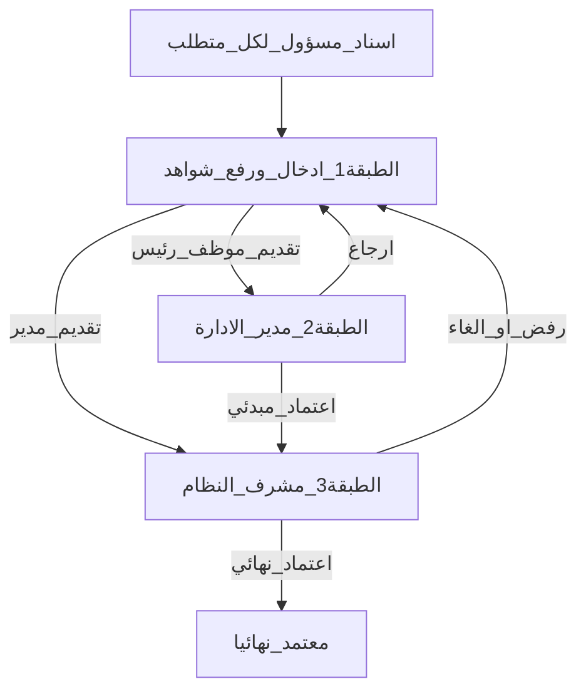

# تقرير هيكلة توحيد القياس والطبقات الثلاث

منصة **مِقياس** — جمعية الزاد.  
مصدر قياس موحّد مع ثلاث طبقات: إدخال → اعتماد مبدئي → اعتماد نهائي.

---

## 1) خريطة المجلدات

```
miqyas-phase1/
├── prisma/schema.prisma
├── scripts/
│   ├── import-excel-2026.ts
│   ├── migrate-unified-measurement.ts
│   └── migrate-measurement-layers.ts
├── src/app/(app)/
│   ├── my/                 # شواهد المؤشرات (الطبقة 1)
│   ├── dept-follow/        # مراجعة الإدارة (الطبقة 2)
│   ├── approvals/          # الاعتماد النهائي (الطبقة 3)
│   └── admin/assign/       # إسناد المسؤولين (مشرف + مدير إدارة)
├── src/app/api/
│   ├── my/measurements/
│   ├── dept-follow/
│   ├── approvals/
│   └── admin/assign/
└── docs/architecture-measurement-unification.md
```

---

## 2) الطبقات الثلاث



| الطبقة | من | ماذا يفعل |
|--------|-----|-----------|
| 1 | المالك المسند (`ownerId`) حسب الدور | فعلي + ماذا/كيف + شواهد → مسودة أو تقديم |
| 2 | مدير الإدارة | اعتماد مبدئي أو إرجاع مع **ملاحظات القسم** |
| 3 | مشرف النظام فقط | اعتماد نهائي / رفض / إلغاء نهائي |

### حالات الفترة × من يرى الملاحظات × أين يظهر العنصر

| الحالة | المالك `/my` | المدير `/dept-follow` | المشرف `/approvals` |
|--------|--------------|----------------------|---------------------|
| DRAFT + rejectReason | ملاحظات القسم في الصف/التوسيع | بطاقة بمقتطف إن وُجدت فترة | — |
| SUBMITTED (بعد إلغاء نهائي) | إن كان مالكاً | بطاقة + نافذة «ملاحظات القسم / المشرف» | — |
| INITIAL_APPROVED | — | شارة بانتظار المشرف | طابور الاعتماد + ملاحظات سابقة إن وُجدت |
| FINAL_APPROVED | — | — | طابور الإلغاء |
| REJECTED_* | ملاحظات القسم | — | — |

### تفريق من يملأ / الإسناد
- `fillerRole` + `ownerId` على المتطلب
- شاشة `/admin/assign`: فلتر + قائمة منسدلة داخل كل صف (`الاسم — الدور`)
- مرشح واحد فقط → إسناد تلقائي
- مدير الإدارة يسند ضمن إدارته؛ المشرف لكل الإدارات
- `/my` يعرض فقط ما يملكه المستخدم ضمن إدارته

---

## 3) نموذج البيانات

```
MeasurementRequirement (code, fillerRole, ownerId, departmentId…)
  ├── MeasurementPeriod (فعلي، سرد، حالة الاعتماد، rejectReason، reviewFeedback)
  │     ├── Evidence (status ACTIVE/REJECTED + سبب)
  │     └── ApprovalEvent (تراكم الإجراءات)
  └── Kpi[] ← إسقاط مزامَن عبر measurement-sync
```

التحليلات واللوحات تعتمد الحالة **معتمد نهائياً** فقط.

عند الإرجاع/إلغاء الاعتماد: إن `ownerId` فارغ يُعاد ربطه بـ `enteredBy` إن كان مؤهلاً (`rebindOwnerIfMissing`).

---

## 4) مصفوفة الصلاحيات

| الدور | التنقّل | إدخال | مراجعة إدارة | إسناد | اعتماد نهائي |
|-------|---------|-------|--------------|-------|--------------|
| موظف | شواهد المؤشرات | متطلباته | لا | لا | لا |
| رئيس قسم | شواهد المؤشرات | متطلباته | لا | لا | لا |
| مدير إدارة | شواهد + مراجعة + إسناد | متطلباته | نعم | إدارته فقط | لا |
| تنفيذي | لوحات ومسارات | لا | لا | لا | لا |
| مشرف النظام | الكل + إسناد + اعتماد نهائي | نعم | لا (يُحوَّل للاعتماد النهائي) | نعم | نعم |

---

## 5) تدفق الشاهد والإشعار

1. المدخل يرفع الشاهد على فترة القياس الموحّدة.
2. مدير الإدارة يراجع ويعتمد مبدئياً أو يرجع مع ملاحظات ظاهرة في الواجهة.
3. مشرف النظام يقبل أو يرفض أو يلغي الاعتماد النهائي مع سبب.
4. الإشعار: المالك → رابط `/my?mp=`؛ مدير الإدارة → `/dept-follow` عند الحاجة. لا إشعار `/my` لمن ليس مالكاً حالياً.

---

## 6) إعادة البذرة والتجربة

```bash
cd miqyas-phase1
npx prisma db push
npx prisma generate
npm run seed
npm run seed:excel
npm run build
npm run dev
```

---

## 7) ملحق النشر السحابي (لاحق)

- ربط المستودع / PostgreSQL / Docker / دومين / TLS / أسرار الإنتاج  
غير منفَّذ في هذه الجولة.
