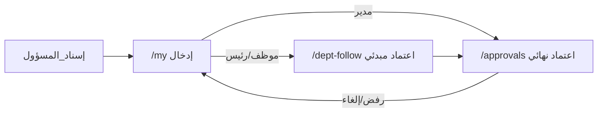

# تقرير منصة مِقياس — الأدوات والمعمارية المعتمدة

**المنصة:** مِقياس (miqyas) v0.1.0  
**الجهة:** جمعية الزاد  
**المستودع:** `mqiasPlatform.zaad`  
**آخر دمج على `main`:** `7e3dc07` — ضبط واجهات الاعتماد والإسناد  
**التاريخ:** 2026-07-31

---

## 1) ملخص تنفيذي

مِقياس منصة مؤسسية عربية (RTL) لقياس مؤشرات الأداء وإدارتها عبر **مصدر قياس موحّد** و**ثلاث طبقات اعتماد**: إدخال → اعتماد مبدئي (مدير الإدارة) → اعتماد نهائي (مشرف النظام). تدعم مسارات تحليلية (استراتيجي/تشغيلي)، إنذاراً مبكراً، بطاقات انحراف، حوكمة، ومعرفة مؤسسية.

---

## 2) المكدس التقني المعتمد

| الطبقة | الأداة | الإصدار (مقفّل) | الدور |
|--------|--------|------------------|-------|
| إطار الويب | **Next.js** (App Router) | 14.2.5 | صفحات، API Routes، Middleware، `output: standalone` |
| واجهة | **React** | 18.3.1 | مكوّنات العميل |
| لغة | **TypeScript** | 5.9.3 | أمان الأنواع |
| قاعدة البيانات | **PostgreSQL** | 15+ (مستحسن) | التخزين الدائم |
| ORM | **Prisma** + `@prisma/adapter-pg` + `pg` | 7.8.0 / 8.22.0 | مخطط، ترحيلات، عميل |
| مصادقة | **NextAuth.js** (Credentials) | 4.24.14 | جلسات JWT |
| تشفير كلمات المرور | **bcryptjs** | 3.0.3 | هاش كلمات المرور |
| تحقق مدخلات | **Zod** | 4.4.3 | مخططات API والنماذج |
| بريد | **Nodemailer** | 7.0.13 | SMTP + سجل بريد |
| رسوم بيانية | **Recharts** | 3.9.2 | لوحات ومسارات |
| أيقونات | **Lucide React** | 1.23.0 | أيقونات الواجهة |
| تنبيهات UI | **Sonner** | 2.0.7 | Toast |
| استيراد Excel | **xlsx** | 0.18.5 | استيراد مؤشرات/بيانات |
| تشغيل سكربتات | **tsx** | 4.23.0 | seed / استيراد / ترحيل |
| تنسيق الشفرة | **ESLint** + `eslint-config-next` | 8.57.1 / 14.2.5 | جودة الكود |

**غير مستخدم عمداً:** Tailwind، MUI، shadcn — التصميم عبر نظام **Tmkeen** (CSS مخصّص + توكنات).

---

## 3) البنية التشغيلية والنشر

| العنصر | الاعتماد |
|--------|----------|
| نظام التشغيل المستحسن | Ubuntu 22.04+ |
| وقت التشغيل | Node.js 20 LTS |
| عملية الإنتاج | **PM2** (`ecosystem.config.js` → standalone `server.js`) |
| وكيل عكسي | **Nginx** (`nginx/miqyas.conf`) |
| CI/CD | GitHub Actions → SSH (`appleboy/ssh-action`) → `deploy.sh` عند الدفع إلى `main` |
| حاويات | لا Docker حالياً |
| إعدادات البيئة | `.env` / `.env.example` |

**متغيرات أساسية:** `DATABASE_URL`, `NEXTAUTH_URL`, `NEXTAUTH_SECRET`, `ADMIN_EMAIL`, `ADMIN_PASSWORD`, `SMTP_*`, `APP_URL`, `ENABLE_UAT`, `CRON_SECRET`.

---

## 4) الأدوار والصلاحيات

| الدور | الرمز | أبرز الصلاحيات |
|-------|-------|----------------|
| مشرف النظام | `SYSTEM_ADMIN` | إسناد كل الإدارات، اعتماد نهائي، إدارة مستخدمين/مؤشرات/إعدادات، لوحات |
| الإدارة العليا | `EXECUTIVE` | لوحة تنفيذية + مسارات القياس |
| مدير إدارة | `DEPT_MANAGER` | شواهد مسندة، مراجعة إدارة، إسناد ضمن إدارته |
| رئيس قسم | `SECTION_HEAD` | شواهد المؤشرات المسندة |
| موظف | `EMPLOYEE` | شواهد المؤشرات المسندة |

التنقّل حسب الدور: `src/lib/nav.ts` · القدرات: `src/lib/rbac.ts` · حماية المسارات: `src/middleware.ts`.

---

## 5) طبقات القياس والاعتماد

| الطبقة | الواجهة | الفاعل | النتيجة |
|--------|---------|--------|---------|
| 1 إدخال | `/my` | مالك المتطلب (`ownerId`) | مسودة / تقديم |
| 2 مراجعة إدارة | `/dept-follow` | مدير الإدارة | اعتماد مبدئي أو إرجاع + ملاحظات القسم |
| 3 نهائي | `/approvals` | مشرف النظام | اعتماد / رفض / إلغاء نهائي |

**نموذج موحّد:** `MeasurementRequirement` → `MeasurementPeriod` (+ `Evidence`, `ApprovalEvent`) → مزامنة إلى `Kpi` / `KpiEntry` عبر `measurement-sync`.  
التحليلات تعتمد الحالة **معتمد نهائياً** فقط.

**الإسناد:** `/admin/assign` — فلتر + قائمة منسدلة لكل متطلب (`الاسم — الدور`)؛ مرشح واحد → إسناد تلقائي؛ المدير ضمن إدارته فقط.

---

## 6) الوحدات الوظيفية في الواجهة

| المسار | الوظيفة |
|--------|---------|
| `/login` … `/reset-password` | دخول واستعادة كلمة المرور |
| `/dashboard` | لوحة رئيسية |
| `/my` | شواهد المؤشرات (إدخال + شواهد) |
| `/dept-follow` | مراجعة الإدارة |
| `/approvals` | الاعتماد النهائي / إلغاء |
| `/admin/assign` | إسناد المسؤولين |
| `/admin/users` · `/admin/kpis` · `/admin/settings` · `/admin/import` | إدارة النظام |
| `/strategic` · `/operational` | مسارات القياس |
| `/early-warning` · `/deviation` | إنذار مبكر وبطاقات انحراف |
| `/governance` · `/knowledge` | حوكمة ومعرفة |
| `/executive` | لوحة الإدارة العليا |
| `/uat` | تقييم الأدوات (إن `ENABLE_UAT`) |

---

## 7) نموذج البيانات (Prisma)

**25 نموذجاً** أبرزها: `User`, `Department`, `Section`, `StrategicGoal`, `OperationalGoal`, `Kpi`, `MeasurementRequirement`, `MeasurementPeriod`, `Evidence`, `ApprovalEvent`, `KpiEntry`, `EarlyWarningAlert`, `DeviationCard`, `GovernanceRequirement`, `KnowledgeAsset`, `Notification`, `SystemSetting`, `AuditLog`.

**18 تعداداً** تشمل: `Role`, `ApprovalStatus`, `FillerRole`, `Period`, `KpiType`, `EvidenceStatus`, …

الملف: `prisma/schema.prisma` · الترحيلات تحت `prisma/migrations/`.

---

## 8) مكتبات المنطق الداخلي (مختصر)

| المجال | ملفات رئيسية |
|--------|---------------|
| مصادقة وصلاحيات | `auth.ts`, `rbac.ts`, `admin-auth.ts` |
| قياس واعتماد | `approval-status.ts`, `measurement-sync.ts`, `my-measurements.ts`, `review-feedback.ts`, `review-notify.ts`, `requirement-owner.ts` |
| تحليلات | `analytics.ts`, `strategic-analytics.ts`, `operational-analytics.ts`, `executive.ts`, `status5.ts` |
| إنذار/انحراف/حوكمة/معرفة | `early-warning-*`, `deviation-stats.ts`, `governance-*`, `knowledge-*` |
| بريد وإشعارات | `mailer.ts`, `notify.ts` |
| استيراد | `import-excel.ts`, `import-analysis.ts` |
| جدولة | `cron-jobs.ts` + `/api/cron` |

---

## 9) واجهة المستخدم والتصميم

- اتجاه: **RTL** (`lang="ar" dir="rtl"`)
- خط: **Tajawal**
- نظام تصميم: توكنات **Tmkeen** (`tokens.css`, `components.css`, `globals.css`)
- مكوّنات مراجعة: بطاقات طابور، بحث ذكي، نافذة عمل مراجعة مع قرارات حقل/شاهد
- تنبيهات: Sonner عبر `ui-toast.ts`

---

## 10) حسابات التجربة (بعد البذرة)

| البريد | الدور | كلمة المرور النموذجية |
|--------|-------|------------------------|
| `admin@zad.org.sa` | مشرف | من `ADMIN_PASSWORD` |
| `executive@zad.org.sa` | تنفيذي | من `DEMO_USER_PASSWORD` بعد `seed:excel` (UAT فقط) |
| `manager@zad.org.sa` | مدير إدارة | من `DEMO_USER_PASSWORD` بعد `seed:excel` (UAT فقط) |
| `head@zad.org.sa` | رئيس قسم | من `DEMO_USER_PASSWORD` بعد `seed:excel` (UAT فقط) |
| `employee@zad.org.sa` | موظف | من `DEMO_USER_PASSWORD` بعد `seed:excel` (UAT فقط) |

أوامر: `npm run seed` · `npm run seed:excel`.

---

## 11) الوثائق المرجعية

| الملف | المحتوى |
|-------|---------|
| `docs/architecture-measurement-unification.md` | الطبقات الثلاث وحالات الاعتماد والإسناد |
| `docs/uat-tools-checklist.md` | قائمة تقييم الأدوات |
| `README.md` | تشغيل سريع |
| `DEPLOYMENT.md` | نشر VPS / Nginx / PM2 |

---

## 12) حالة الدمج الأخيرة (هذا التسليم)

- الفرع: `cursor/approval-interfaces-ad33`
- الدمج: **fast-forward إلى `main`** والرفع إلى `origin/main` (`7e3dc07`)
- أبرز ما دُمج: ملاحظات القسم في الواجهات، إعادة ربط المالك عند الإرجاع/الإلغاء، إسناد المدير + قائمة منسدلة لكل مؤشر، حواجز الإشعار، تحديث وثيقة المعمارية
- التحقق: `tsc --noEmit` و`npm run build` ناجحان قبل الدمج

---

## 13) حدود النطاق الحالية

- لا حاويات Docker جاهزة في المستودع
- الاعتماد النهائي لمشرف النظام فقط
- لا توزيع تلقائي بالتناوب بين موظفين (مرفوض تصميمياً)
- التحليلات بعد الاعتماد النهائي فقط
